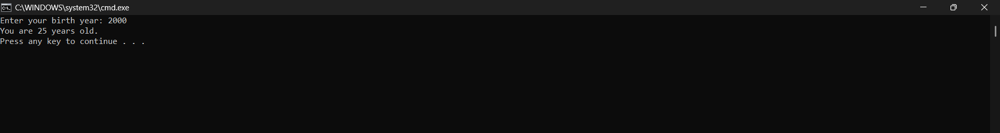

# Operating System Course - Day 02

[](https://learn.microsoft.com/en-us/windows-server/administration/windows-commands/windows-commands)
[](https://www.microsoft.com/windows)
[]()
[]()

> 📚 A comprehensive collection of daily practical lessons for Operating System course focusing on Windows batch scripting.

## 📋 Course Overview

This repository contains practical exercises and implementations for the Operating System course. Each lesson is organized with batch scripts and their corresponding outputs.

## 🗓️ Day 02 Content

### 🎯 Learning Materials

In this session, we explore various Windows batch scripting concepts and system operations. The implementations demonstrate practical usage of batch commands and system interactions.

### 📊 Implementation Structure

| Category | Description | Visual Output |
|----------|-------------|---------------|
| Script Output | Batch script execution results |  |

The image above (1.png) demonstrates the execution results of our Windows batch script operations. This visual output showcases:
- Command prompt interactions
- System command executions
- Output formatting and display
- Real-time command responses

### 🔍 Technical Notes

- Implementation focuses on Windows Batch Script commands
- Each script demonstrates specific system operations
- Output captures show real-time execution results
- Follows consistent command structure and formatting

### 📝 Code Explanations

#### Practical01.txt - Age Calculator Batch Script
```batch
@echo off
:: hides the command execution

:: displays the title 'Age calculator'
echo Age calculator

::/p - obtain user inputs
set /p birth_year=Enter your birth year :

:: display current date
echo %date%

:: extracts only the year
set current_year=%date:~10,4%

::/a - for variables with numeric values
:: get the difference between current year and the birth year
set /a age=%current_year%-%birth_year%

:: display the Age
echo You are %age% years old!

:: display only the date
set /a date=%date:~7,2%
echo Date : %date%

:: diplay only the month
set month=%date:~4,2%
echo Month: %month%

:: display only the year
echo Year : %current_year%

pause
```

**Line-by-line explanation:**
1. `@echo off` - Disables command echoing
2. `::` comments - Explain script functionality
3. `set /p` - Gets user input for birth year
4. `%date%` - Displays system date
5. `%date:~10,4%` - Extracts year from date
6. Mathematical calculation for age
7. Date components extraction using substring

#### Practical02.txt - Linux Command Reference
```bash
pwd # Shows current directory path
who # Displays logged-in users
awk # Text processing tool
sed # Stream editor for text manipulation
ls -ltr # Time-sorted long listing
ls -a # Show hidden files
```

**Command explanations:**
- `pwd`: Print working directory path
- `who`: List active user sessions
- `awk`: Pattern scanning/text processing
- `sed`: Stream editing capabilities
- `ls -ltr`: Sort by modification time (oldest first)
- `ls -a`: Include hidden dotfiles
- `ls -lh`: Human-readable file sizes

---

<div align="center">

📖 **Learning Path** | 🛠️ **Practical Examples** | 📊 **Visual Outputs**

</div>
